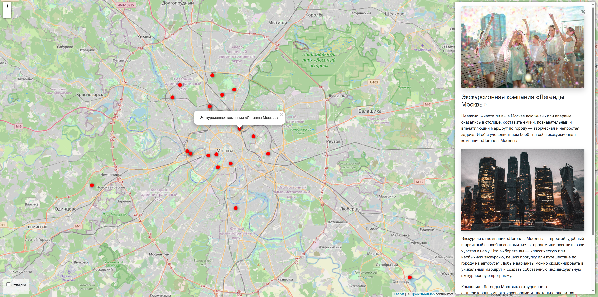

# Сайт «Куда пойти»

Django-сайт с интерактивной картой мест Москвы. Метки на карте кликабельны, по клику в боковой панели открывается описание места с фотографиями.



### Как установить
Для работы нужны переменные окружения. 
- SECRET_KEY - ключ-пароль для Джанго проекта, обычно произвольная случайная последовательность знаков.
Требуется для запуска проекта.
- ALLOWED_HOST - список доменных имён, с которыми Джанго может работать. Требуется для предотвращения подмены хоста.
- DEBUG - значение `bool`, включающее и отключающее дебаг режим. 
Включённый режим активирует выдачу подробной трассировки ошибок, которая раскрывает текущие настройки Джангю

Они должны быть указаны в файле `.env` в виде:
```commandline
SECRET_KEY=[KEY]
DEBUG=[True or False]
ALLOWED_HOSTS=127.0.0.1,localhost
```

Python3 должен быть уже установлен, работоспособность проверена на версии 3.14. Затем используйте `pip` (или `pip3`, если есть конфликт с Python2) для установки зависимостей:
```pip install -r requirements.txt```


Создайте базу данных:

```python manage.py migrate```

Создайте администратора для доступа к панели управления командой:

```python manage.py createsuperuser```

Следуйте указаниями терминала для создания админки.

### Как использовать

Запустите сервер командой:

```python manage.py runserver```

Сайт будет доступен по адресу http://127.0.0.1:8000/, панель управления — http://127.0.0.1:8000/admin/

### Как добавить места

Место добавляется из JSON-файла по ссылке:

```python manage.py load_place [ссылка]```

Команда проверит есть ли такое место в базе и если нет - загрузит фотографии и добавит запись. 

Формат JSON:
```json
{
  "title": "",
  "description_short": "",
  "description_long": "",
  "coordinates": {
    "lat": "",
    "lng": ""
  },
  "imgs": [
    "",
    ""
  ]
}
```
Места также можно добавлять и редактировать через панель управления.

### Цель проекта
Код написан в образовательных целях на онлайн-курсе для веб-разработчиков [dvmn.org](https://dvmn.org/).